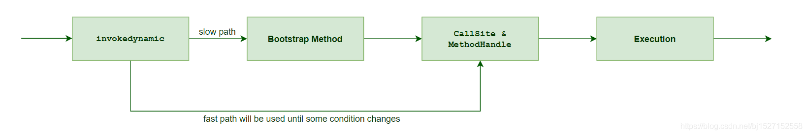

今天在优化代码的时候，在把一些空判断做精简的时候，想用Optional来完成，于是就查了一些其他人总结的使用经验和[官方文档](https://docs.oracle.com/javase/8/docs/api/java/util/Optional.htm)。

就在这其中，发现了一件有意思的事.

我在阅读这篇[博客](https://www.cnblogs.com/rjzheng/p/9163246.html)的时候，在文中会看到这么一段话
注意红字的描述，使用```orElse```依然会执行其中的方法。但是没有说明为什么。于是我做了如下实验

```Java
public void test(){
	Integer x= null;
	Integer y = null;
	Integer t = null;
	x = Optional.ofNullable(t).orElse(getNew());
	t = 5;
	y = Optional.ofNullable(t).orElse(getNew());
}
public Integer getNew(){
	System.out.println("out!");
	return 3;
}
```
结果就是编译通过，两次都输出了out。

这让我觉得事情并不简单，于是我查看了这段代码的字节码。

```Bytecode
	public test() { //()V
         L1 {
             aconst_null
             astore1
         }
         L2 {
             aconst_null
             astore2
         }
         L3 {
             aconst_null
             astore3
         }
         L4 {
             aload3
             invokestatic java/util/Optional.ofNullable(Ljava/lang/Object;)Ljava/util/Optional;
             aload0 // reference to self
             invokevirtual A.getNew()Ljava/lang/Integer;
             invokevirtual java/util/Optional.orElse(Ljava/lang/Object;)Ljava/lang/Object;
             checkcast java/lang/Integer
             astore1
         }
         L5 {
             iconst_5
             invokestatic java/lang/Integer.valueOf(I)Ljava/lang/Integer;
             astore3
         }
         L6 {
             aload3
             invokestatic java/util/Optional.ofNullable(Ljava/lang/Object;)Ljava/util/Optional;
             aload0 // reference to self
             invokedynamic java/lang/invoke/LambdaMetafactory.metafactory(Ljava/lang/invoke/MethodHandles$Lookup;Ljava/lang/String;Ljava/lang/invoke/MethodType;Ljava/lang/invoke/MethodType;Ljava/lang/invoke/MethodHandle;Ljava/lang/invoke/MethodType;)Ljava/lang/invoke/CallSite; : get(LA;)Ljava/util/function/Supplier; ()Ljava/lang/Object; A.lambda$test$0()Ljava/lang/Integer; (7) ()Ljava/lang/Integer;
             invokevirtual java/util/Optional.orElseGet(Ljava/util/function/Supplier;)Ljava/lang/Object;
             checkcast java/lang/Integer
             astore2
         }
         L7 {
             return
         }
     }

     public getNew() { //()Ljava/lang/Integer;
         L1 {
             getstatic java/lang/System.out:java.io.PrintStream
             ldc "out!" (java.lang.String)
             invokevirtual java/io/PrintStream.println(Ljava/lang/String;)V
         }
         L2 {
             iconst_3
             invokestatic java/lang/Integer.valueOf(I)Ljava/lang/Integer;
             areturn
         }
     }

     private synthetic lambda$test$0() { //()Ljava/lang/Integer;
         L1 {
             aload0 // reference to self
             invokevirtual A.getNew()Ljava/lang/Integer;
             areturn
         }
     }
```
核心差异就出现在使用
```
invokevirtual A.getNew()Ljava/lang/Integer;
```
和
```
invokedynamic java/lang/invoke/LambdaMetafactory.metafactory(Ljava/lang/invoke/MethodHandles$Lookup;Ljava/lang/String;Ljava/lang/invoke/MethodType;Ljava/lang/invoke/MethodType;Ljava/lang/invoke/MethodHandle;Ljava/lang/invoke/MethodType;)Ljava/lang/invoke/CallSite; :get(LA;)Ljava/util/function/Supplier; ()Ljava/lang/Object;A.lambda$test$0()Ljava/lang/Integer; (7) ()Ljava/lang/Integer;
```
看来问题就是出在了```invokedynamic```和```invokevitrual```
同时参考源码
```Java
    /**
     * If a value is present, returns the value, otherwise returns
     * {@code other}.
     *
     * @param other the value to be returned, if no value is present.
     *        May be {@code null}.
     * @return the value, if present, otherwise {@code other}
     */
    public T orElse(T other) {
        return value != null ? value : other;
    }

    /**
     * If a value is present, returns the value, otherwise returns the result
     * produced by the supplying function.
     *
     * @param supplier the supplying function that produces a value to be returned
     * @return the value, if present, otherwise the result produced by the
     *         supplying function
     * @throws NullPointerException if no value is present and the supplying
     *         function is {@code null}
     */
    public T orElseGet(Supplier<? extends T> supplier) {
        return value != null ? value : supplier.get();
    }
```
不难发现，当入参为泛型T时，表达式会自动求值，但是Supplier类型的参数会等到下面的执行get方法再执行。
为什么会Supplier类型不会自动执行呢，而泛型入参却会求值呢？
于是我找到了[The Java® Language Specification](https://docs.oracle.com/javase/specs/jls/se11/jls11.pdf)，我用的是11，所以就直接看11的版本了，在15.1 Evaluation, Denotation, and Result章节中有如下描述
>If an expression denotes a variable, and a value is required for use in further evaluation, then the value of that variable is used. In this context, if the expression denotes a variable or a value, we may speak simply of the value of the expression.

以及后面的这段
>Evaluation of an expression can produce side effects, because expressions may contain embedded assignments, increment operators, decrement operators, and method invocations.

于是便有了结果，在上面源码中``elseGet``方法的泛型值在下面的表达式中被使用了，所以他就会进行求值操作，带来的副作用如下面一段引用的描述，带来了方法的执行了具体的方法。

那么关于``invokedynamic``呢？
通过查阅这篇[文章](https://www.baeldung.com/java-invoke-dynamic)，我们可以看到``invokedynamic``是在java7引进并在之后的动态类型上使用的，能让我们在任何时候启动函数的调用。下图是文中关于执行的描述。

简而言之，在调用每一个lambda表达式时，会在运行时中生成一个类似内部类的引用，之后每次调用都会指向这个地址，``invokedynamic``也就像是指向内存中某一位置用于执行动态生成字节码的指令了。也就是当``orElseGet``方法只有在为空的时候才会执行lambda的``get``方法时执行实际的函数体。

上述的总结只是简单描述``invokedynamic``的作用具体的细节还是需要阅读jvm11规范来了解。

update:stackoverflow的这个[回答](https://stackoverflow.com/questions/6638735/whats-invokedynamic-and-how-do-i-use-it)也非常不错